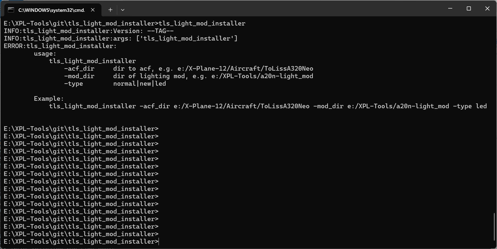
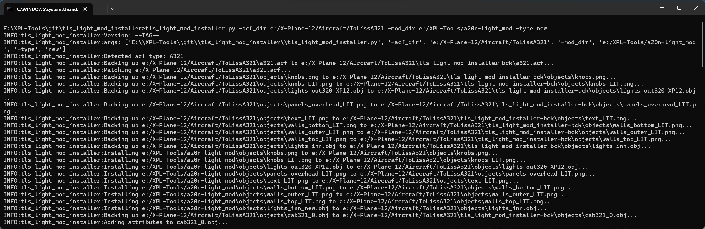

# tls_light_mod_installer
Install a20n-light_mod  https://forums.x-plane.org/files/file/93337-a320-light-mod for Toliss planes.

## Support
Discord only: https://discord.gg/Zu2nEcxeDd

## Installation
Download the latest release from here: https://github.com/hotbso/tls_light_mod_installer/releases/latest .
Unpack in any directory.

## How it works
For all affected files the installer creates a backup **once** in directory ``<aircraft>/tls_light_mod_installer-bck``.
Then it applies patches from these backups and overwrites the original files.\
That means you can apply the installation multiple times.

## How to restore ?
Just copy over the contents of ``<aircraft>/tls_light_mod_installer-bck`` to <aircraft> .

## What to do after an update of the aircraft?
Just delete the folder ``<aircraft>/tls_light_mod_installer-bck`` and run the installer again.

## Usage
This is a command line utility so open an appropriate command window.

Example:
Change A321 to Halogen New

